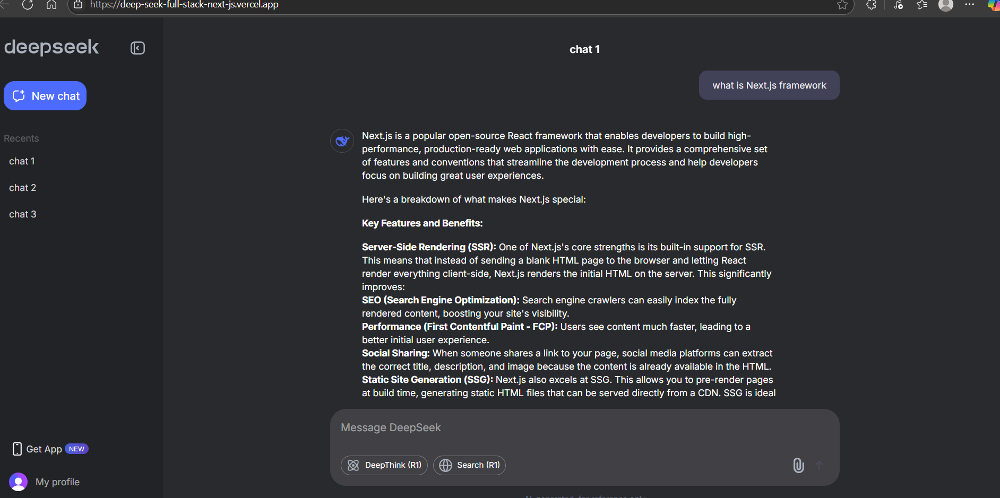
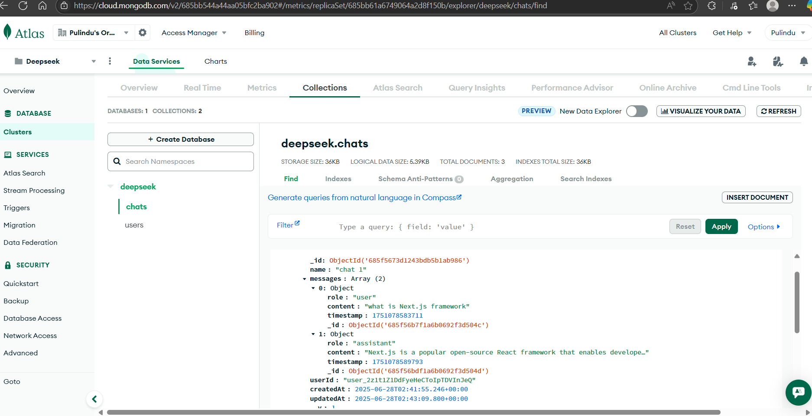
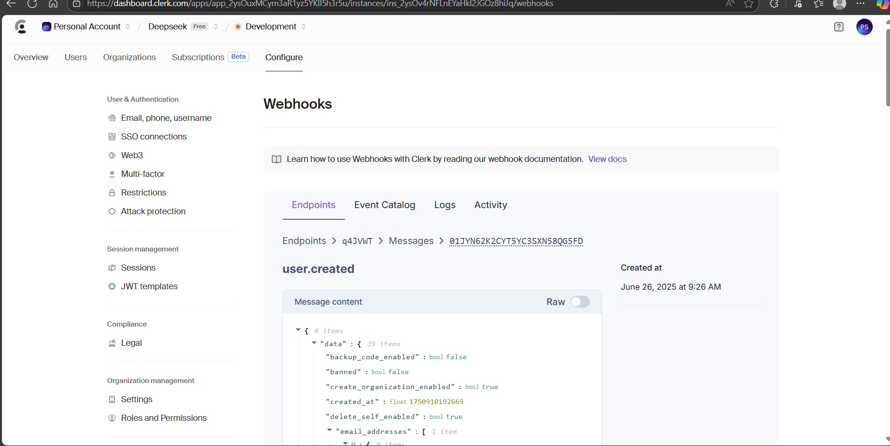
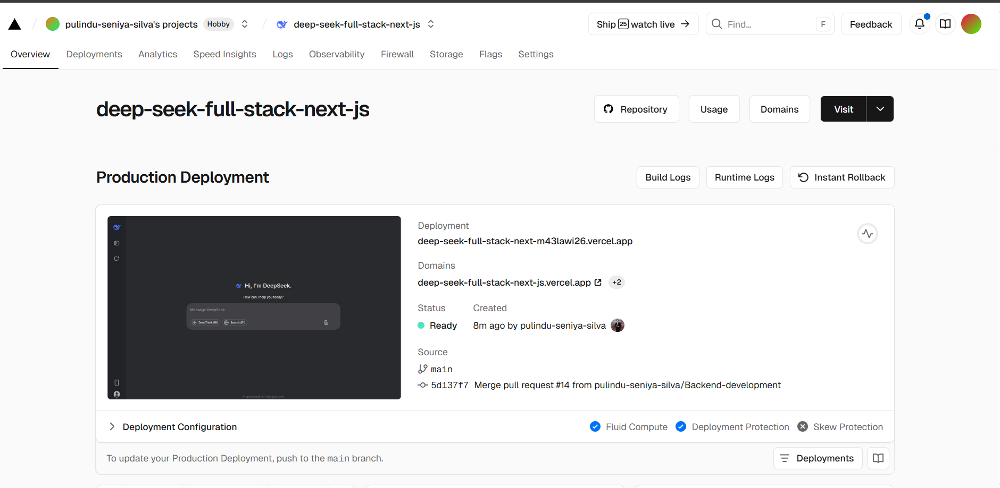

## ✅AI-Powered Chat Interface

## 🎬 Demo
https://github.com/user-attachments/assets/6a205ad0-2ecc-46ac-8763-50320b3194e1

## ✅ MongoDB Connection  

## 🔐 Clerk Webhook Configuration  

## 🚀 Vercel Deployment  

## About App

A sleek and dynamic AI-powered chat application built with Next.js, tailwind css, type script and java script integrating a simulated DeepSeek assistant. This project features:
 Key Features
✅ User Authentication using Clerk

✅ Real-time Chat Interface with prompt handling

✅ AI Response Rendering with animated typing effect

✅ Chat History Management

✅ Chat Rename & Delete with auto-refresh

✅ API integration for AI-generated responses

✅ MongoDB Database for storing chat data

✅ Responsive UI built with Tailwind CSS

This project was created to simulate natural and intelligent conversations with a seamless chat experience, optimized for usability and clarity.

